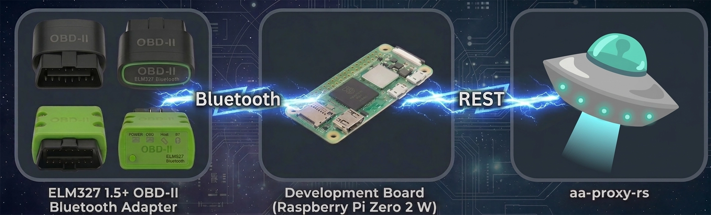

# aa-proxy-obd

## How it works


## Description
A single Linux daemon that reads live EV telemetry (battery, odometer, tire
pressure, temperatures) and forwards it to a local REST consumer — designed for
[`aa-proxy-rs`](https://github.com/aa-proxy/aa-proxy-rs) for Android Auto EV
routing and dashboards. One binary serves three adapter families, selected at
runtime by the config file:

| Adapter type | `device.type` | How it talks to the car |
|---|---|---|
| Bluetooth ELM327 dongle | `bluetooth` | Bluetooth RFCOMM, ELM327 AT commands |
| USB ELM327 dongle       | `usb`       | USB serial, ELM327 AT commands       |
| WiCAN Pro               | `wican`     | BLE GATT, WiCAN AutoPid JSON          |

> **Heritage:** aa-proxy-obd was previously known as `canze-rs` and forked from
> [`manio/canze-rs`](https://github.com/manio/canze-rs.git) — the original
> Renault Zoe SOC logger, whose full Zoe support (TPMS, odometer, energy) lives
> on as the `zoe` profile. The name is a tribute to the
> [CanZE](https://canze.fisch.lu/) project, which remains the reference for the
> underlying PIDs. Its home is
> [`aa-proxy/aa-proxy-obd`](https://github.com/aa-proxy/aa-proxy-obd).

## Supported vehicles (ELM327 profiles)

| Vehicle | Profile | SOC | Battery (Wh) | External temp | Odometer | Tire pressure |
|---|---|:---:|:---:|:---:|:---:|:---:|
| Renault Zoe     | `zoe`    | ✅ | ✅ | ✅ | ✅ | ✅ |
| Hyundai Ioniq 5 | `ioniq5` | ✅ | ✅ | ✅ | ✅ | ✅ |
| Kia EV6         | `ev6`    | ✅ | ✅ | ✅ | ✅ | ✅ |
| MG4             | `mg4`    | ✅ |    | ✅ |    |    |
| Kia Niro        | `niro`   | ✅ |    |    |    |    |

Adding a new vehicle requires no Rust changes — see [Vehicle profiles](#vehicle-profiles).

WiCAN Pro users get whatever their AutoPid configuration exposes (typically SOC
plus outdoor temperature); the WiCAN firmware decodes PIDs itself, so the daemon
does not load a `profiles/` file for `device.type = "wican"`.

## What it transmits
While the adapter is reachable and the car is awake, the daemon polls and
`POST`s JSON to three endpoints on `localhost`. For each endpoint, it sends only
if at least one relevant field was produced this cycle (absent fields are
omitted); otherwise the endpoint is silently skipped.

| Endpoint | Payload |
|---|---|
| `POST {api_base}/battery` | `battery_level_percentage`, `battery_level_wh`, `battery_capacity_wh`, `external_temp_celsius`, `battery_state_of_health`, `battery_voltage`, `battery_current`, `interior_temp_celsius` (all optional) |
| `POST {api_base}/odometer` | `odometer_km`, `trip_km` (optional) |
| `POST {api_base}/tire-pressure` | `pressures_kpa[]` (FL, FR, RL, RR) |

If the active profile reports SOC as a percentage and `battery_capacity_wh` is
set in config, the daemon derives `battery_level_wh = SOC × capacity / 100`
automatically when the profile doesn't report Wh directly.

## Usage
```
aa-proxy-obd [OPTIONS] [COMMAND]

Commands:
  pair    Pair the configured Bluetooth/WiCAN device (and optionally save the passkey)

Options:
  -c, --config <CONFIG>    Config file path [default: /etc/aa-proxy-obd.toml]
  -d, --debug              Override the configured log level to debug
  -h, --help               Print help
  -V, --version            Print version
```

## Config — `/etc/aa-proxy-obd.toml`

Only `device.type`, the device's address (`bt_mac` for `bluetooth`/`wican`,
`usb_port` for `usb`), and `vehicle.profile` (for the ELM327 types) are
required. Everything else is optional and falls back to the defaults shown
below, so a minimal config is just:

```toml
[device]
type   = "bluetooth"
bt_mac = "AA:BB:CC:DD:EE:FF"

[vehicle]
profile = "ev6"
```

Full set of options with their defaults:

```toml
[device]
type                      = "bluetooth"                # bluetooth | usb | wican

bt_mac                    = "AA:BB:CC:DD:EE:FF"        # bluetooth + wican; the adapter's MAC
bt_passkey                = 1234                       # optional; enables in-process pairing
bt_max_connect_retries    = 5                          # bluetooth + wican
bt_timeout_secs           = 10                         # bluetooth + wican; per-attempt connect/response timeout

usb_port                  = "/dev/ttyUSB0"             # ls -l /dev/ttyUSB* /dev/ttyACM* 2>/dev/null
usb_baud                  = 115200

[vehicle]
profile                   = "ev6"                      # ignored when device.type = "wican"
battery_capacity_wh       = 77400                      # optional; enables derived battery_level_wh

[daemon]
poll_interval_secs        = 10
car_sleep_interval_secs   = 100                        # poll interval while the car is asleep
log_level                 = "info"                     # off | error | warn | info | debug | trace
log_file                  = "/var/log/aa-proxy-obd.log"
api_base_url              = "http://localhost"
bridge_dropouts           = true
publish_failure_threshold = 5
publish_breaker_secs      = 300
cycle_failure_limit       = 20
```

The `wican` device type connects over Bluetooth, so it shares the `bt_*`
options (`bt_mac`, `bt_passkey`, `bt_max_connect_retries`, `bt_timeout_secs`).
Keys under `[device]` that don't apply to the selected `type` are ignored.

## Vehicle profiles
Profile JSON files ship under [`profiles/`](profiles/). At install time, copy
them to `/etc/aa-proxy-obd/<profile>.json` (e.g. `profiles/ev6.json` →
`/etc/aa-proxy-obd/ev6.json`). A profile lists one or more `sources`, each with
a `kind` discriminator.

### `uds_pid` source — active request/response
```jsonc
{
  "kind": "uds_pid",
  "ecu_tx": "7E4",          // request header
  "ecu_rx": "7EC",          // response filter
  "pid": "220105",          // service + PID (UDS / Mode 22 typical)
  "pre_request": "10C0",    // optional; sent before the PID, errors ignored
  "multiframe": false,       // opt-in to ISO-TP flow-control reassembly
  "fields": [ /* FieldSpec */ ]
}
```

### `broadcast` source — passive ATMA monitor
```jsonc
{
  "kind": "broadcast",
  "init": ["ATCRA", "ATH1", "ATS1"],
  "command": "ATMA",
  "deadline_ms": 6000,
  "idle_timeout_ms": 600,
  "stop_when": ["external_temp_celsius"],   // field names that end the scan early
  "frames": [
    { "can_id": "673", "fields": [ /* FieldSpec */ ] }
  ]
}
```

### `FieldSpec`
| Key | Type | Required | Behaviour |
|---|---|:---:|---|
| `name` | string | yes | Recognised names route into a known endpoint payload; unknown names are logged but not POSTed. |
| `byte_index` | int | one of byte/bit | **`uds_pid`:** offset from after the UDS header (e.g. `62 XX XX`), so 0 = first data byte; negative counts from the end. **`broadcast`:** offset from the start of the CAN data bytes (no header). |
| `length` | usize | with `byte_index` | 1, 2, or 3 bytes |
| `bit_offset` | int | one of byte/bit | Motorola/big-endian bit index (bit 0 = MSB of byte 0) |
| `bit_length` | usize | with `bit_offset` | 1..=16 |
| `multiplier` | f32 | yes (default 1.0) | `raw × multiplier + offset` |
| `offset` | f32 | yes (default 0.0) | as above |
| `signed` | bool | optional | byte extraction only; sign-extend before scaling |

### Recognised field names
- **Battery:** `battery_level_percentage`, `battery_level_wh`, `external_temp_celsius`, `battery_state_of_health`, `battery_voltage`, `battery_current`, `interior_temp_celsius`
- **Odometer:** `odometer_km`, `trip_km`
- **Tire pressure:** `tire_fl_kpa`, `tire_fr_kpa`, `tire_rl_kpa`, `tire_rr_kpa`

### Adding a vehicle profile
1. Identify the OBD ECU TX/RX headers and the PID(s) for the parameters you want. [CanZE](https://canze.fisch.lu/) is an excellent reference.
2. Work out each field's byte (or bit) offset, length, multiplier, and offset within the response payload.
3. Drop a new JSON file under `profiles/` (and copy it to `/etc/aa-proxy-obd/<name>.json`).
4. Point `profile = <name>` at it in the config. No code changes required.

## Bluetooth pairing
If `[device].bt_passkey` is set, the daemon registers a BlueZ agent at connect
time that supplies the passkey during first pairing (this applies to both the
`bluetooth` and `wican` device types). BlueZ ignores the agent for
already-paired devices.

For one-shot setup:
```sh
aa-proxy-obd pair --passkey 1234     # or omit --passkey to be prompted
```
The subcommand discovers the device (if not already known to BlueZ), pairs it,
and on success offers to write the passkey back into the config under the
appropriate `[device]` key. Config comments and formatting are preserved.

## Failure handling
- **Per-endpoint circuit breaker.** After `publish_failure_threshold` consecutive
  POST failures on an endpoint (default 5), the daemon stops POSTing there for
  `publish_breaker_secs` (default 300s), then probes once and closes on success.
- **`bridge_dropouts`.** When enabled (default), if a cycle produces no payload
  for an endpoint but the previous one did, the daemon re-POSTs the last-good
  value so downstream sees continuity. The cache clears when the car sleeps.
- **Cycle health watchdog.** If `cycle_failure_limit` consecutive cycles produce
  zero successful POSTs (excluding intentional sleep cycles), the daemon logs an
  error and exits code 2 for a supervisor to act on.

| Exit code | Meaning |
|---|---|
| 0 | Clean shutdown on SIGINT / SIGTERM |
| 1 | Startup error — invalid config, missing profile, unparseable MAC |
| 2 | Cycle health watchdog tripped |

## Building
```sh
cargo build --release
```
The vendored [`.cargo/config.toml`](.cargo/config.toml) defaults the target to
`aarch64-unknown-linux-gnu` so the release build cross-compiles for common SBCs
(e.g. Radxa Zero 3W running an aa-proxy-rs image). Run the test suite on the
host with `cargo test --target <host-triple>`.

## License
GPL-2.0. See [`LICENSE`](LICENSE).

## Credits
- Original [`manio/canze-rs`](https://github.com/manio/canze-rs.git) by Mariusz Białończyk — the Renault Zoe SOC logger and TPMS/multiframe work this fork builds on.
- The [CanZE](https://canze.fisch.lu/) project — primary reference for OBD PIDs.
- Reference projects whose capabilities this daemon absorbs: `aa-proxy-go-obd-feeder` (USB OBD) and `aa-proxy-wican` (WiCAN Pro).
